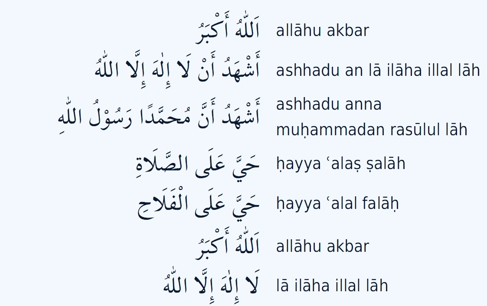
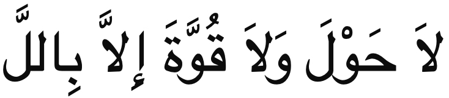

# Azaan



Repeat the azaan, but when you hear
```
hayya àlas salāh -> Lā ḥawla wa lā quwwata 'illā billāh.
hayya àlal falāh -> Lā ḥawla wa lā quwwata 'illā billāh.

Meaning:
There is no might nor power except with Allah.
```


```
Allah is the Greatest.
Allah is the Greatest.

I bear witness that there is none worthy of workshp except Allah.

I bear withness that Muhammed (SAW) is the Messenger of Allah.

Come to Pryar.
Come to success.

Allah is the Greatest.
Allah is the Greatest.

There is none worthy of worship except Allah.

```