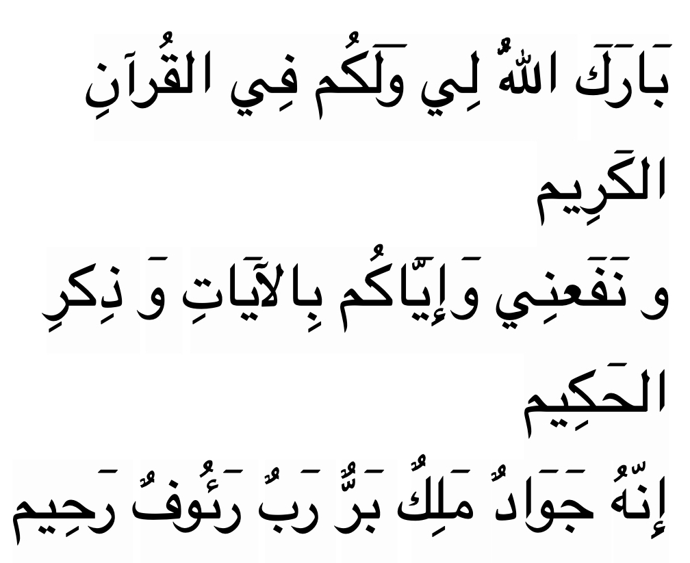

# Ending

Note: It is not from the Qur'an, nor it is a direct hadith from the Prophet S.A.W
Rather, it is a traditional supplication (du’a) often recited by scholars, imams especially after reciting or 
completing a verse or khutbah, as a way of invoking blessings and benefits from the Qur’an.

بٙارٙكٙ اللّٰهُ لِي وٙلٙكُم فِي القُرآنِ الكٙرِيم
و نٙفٙعنِي وٙإِيّٙاكُم بِالآيٙاتِ وٙ ذِكرِ الحٙكِيم
إِنّهُ جٙوٙادٌ مٙلِكٌ بٙرٌّ رٙبٌ رٙئُوفٌ رٙحِيم

Barakallahu lee wa lakum fil quranil kareem. 
Wa nafa’nee wa iyyakum bil aayaati wa dhikril hakeem. Innahu jawaadun malikun barrun rabbur ra’oofur raheem.

“May Allah bless me and you through the guidance of this noble Quran. And may its teachings and remembrances benefit me 
and you. Truly Allah is the Possessor of wealth, the Sovereign,  the All-Good, the One Who has authority and power 
over us, the Loving and Infinitely Merciful.”
